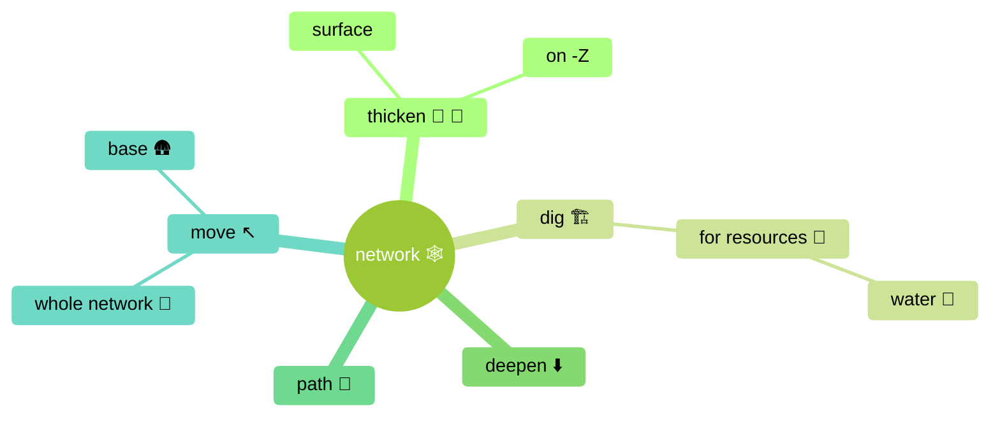

# High Level TODO

- [ ] Drive 🚗 to completion 🏇🏁 "the ⛈ ☁ Smog update 🥬"
  - [ ] Did I got side 🤒🖍️ tracked with Temperature 😎☀🧊 and melting ice ?
    - [ ] What is the core of smog -> absorb loop
- [ ] Tasks list in somewhere
  - [ ] GitHub Kanban ?
  - [ ] Even high level themes to know what to pick up when transitioning FullTime -> PartTime
- [ ] Export Workflowy to `.md` to have local docs / notes archive ?
  
# Project Questions

- [ ] OpenSource before 1.0 ?

## Network UI

### Actions

- [ ]  Fill in the list

### Diagram

# 🧽 🧼 🫧 Code Clean-up 🪥 🧹 

There is a lot to remove, and a lot to change and simplify

## General approach ?

### Remove ️️✂️ 🧟‍♂ 🪠

- [ ] Data 📚
- [ ] Assets 🖼️
- [ ] Dead Code 🪠 🧾
- [ ] Unused Scenes 🎬

## Remainder 🧠 Leads to clean 🧹 

- [ ] [BuildingObject](../Model/Objects/BuildingObject.gd)  `BuildingObject` : `_model.view_changed.emit` and `_mode.view_changed.connect` used for passing if production status changed `_model <-> UI`
- [ ] Whole [BuildingObject](../Model/Objects/BuildingObject.gd) need to be changed to remove the data out and move it to actual resource on disk